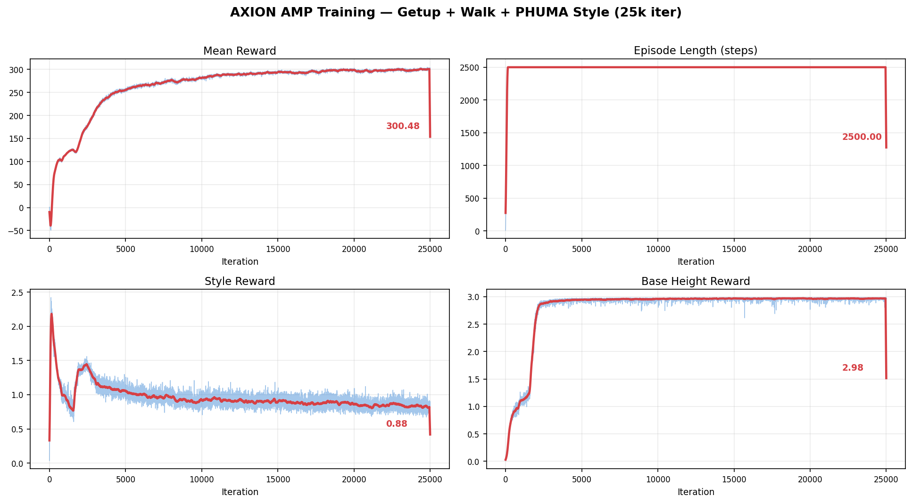
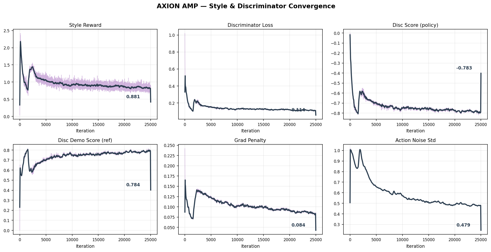
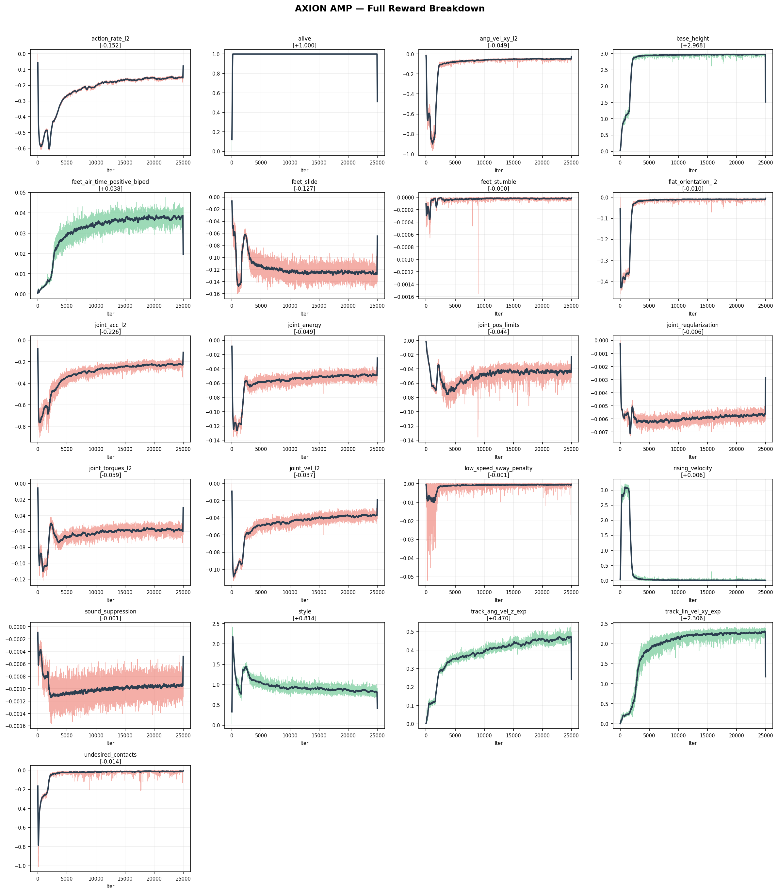

# AXION Training

Humanoid robot RL training codebase for **Roboparty Atom01** (18-DoF biped), built on [IsaacLab](https://github.com/isaac-sim/IsaacLab) + [rsl_rl](https://github.com/leggedrobotics/rsl_rl).

Implements **AMP (Adversarial Motion Priors)** for simultaneous fall recovery, locomotion, and human motion style imitation.

---

## Results — AMP Getup + Walk + PHUMA Style

**Task**: `Atom01-AMP-Getup-Phuma-V3`
Three behaviors trained jointly: fall recovery (52%) + walking (24%) + PHUMA style imitation (24%)

| Metric | Value |
|--------|-------|
| Training iterations | 25,000 |
| Style reward | **0.881** |
| Mean reward | ~300 |
| Episode length | **2500 steps (max, fully converged)** |
| Training hardware | NVIDIA RTX 3090 |
| Training duration | ~17.5 hours |

### Demo Video

<video src="https://github.com/Kitjesen/axion-train/releases/download/v1.0.0/demo.mp4" controls width="100%"></video>

▶ [Download demo.mp4](https://github.com/Kitjesen/axion-train/releases/download/v1.0.0/demo.mp4) — 64 robots, Getup+Walk+PHUMA style, model_24999.pt

### Training Curves



*Mean reward converges to ~300 by ~10k iterations; episode length saturates to max (2500) within 5k iterations — the robot stops falling entirely.*



*Discriminator loss converges to 0.11; style reward stabilizes at **0.881**, disc_demo_score reaches 0.784 (policy motions approach reference quality).*



---

## Method

We use **AMP (Adversarial Motion Priors)** [[Peng et al. 2021](https://arxiv.org/abs/2104.02180)] adapted for humanoid robots, combining:

1. **PPO** policy optimization with discriminator-based style reward
2. **Multi-task motion library**: getup clips + walking clips + PHUMA motion capture data
3. **Push disturbance curriculum**: random external forces every 25–40s to train robustness

The discriminator is trained to distinguish between policy rollouts and reference motion clips, providing a style reward signal that guides the policy toward natural human-like motion.

### Reference Motion Library

| Source | Clips | Type |
|--------|-------|------|
| `atom01_phuma_sample200` | 200 clips | PHUMA mocap → Atom01 retargeted |
| `atom01_lab_combined_phuma` | 40,691 clips | Full PHUMA dataset retargeted |
| `atom01_getup` | ~100 clips | Getup motion sequences |
| `atom01_walk` | ~50 clips | Walking sequences |

---

## Codebase Structure

```
robolab/                   # IsaacLab environment package (pip install -e .)
├── robolab/tasks/
│   └── manager_based/
│       ├── amp/           # AMP task definitions
│       │   ├── atom01_amp_getup_phuma_env_cfg.py   # V3 task config
│       │   ├── amp_env.py                          # AMP environment
│       │   ├── managers/
│       │   │   ├── motion_data_manager.py          # Motion library loader
│       │   │   └── animation_manager.py            # Reference state sampling
│       │   └── mdp/
│       │       ├── rewards.py                      # 20+ reward functions
│       │       └── observations.py
│       ├── standup/       # Fall recovery (HoST-style multi-critic)
│       └── beyondmimic/   # BeyondMimic task
├── scripts/rsl_rl/
│   ├── train.py           # Training entry point
│   ├── play_amp.py        # Playback + video recording
│   └── play_standup.py
├── scripts/tools/retarget/
│   ├── gmr_to_lab.py      # GMR mocap → IsaacLab format
│   └── dataset_retarget.py
└── data/robots/roboparty/atom01/
    ├── urdf/atom01.urdf
    └── mjcf/atom01.xml

rsl_rl/                    # rsl_rl extensions
└── rsl_rl/
    ├── algorithms/ppo_multi_critic.py    # Multi-critic PPO (for standup)
    ├── modules/actor_critic_multi_critic.py
    ├── runners/standup_runner.py
    └── storage/multi_critic_rollout_storage.py
```

---

## Training

### Prerequisites

```bash
# IsaacLab (tested on IsaacLab 2.x / Isaac Sim 4.x)
pip install -e robolab/
pip install -e rsl_rl/

# Motion data: place PKL files under robolab/data/motions/
```

### Run AMP Training

```bash
# Train from scratch
CUDA_VISIBLE_DEVICES=0 python robolab/scripts/rsl_rl/train.py \
  --task=Atom01-AMP-Getup-Phuma-V3 \
  --headless --num_envs=2048 --device=cuda:0

# Resume from checkpoint
CUDA_VISIBLE_DEVICES=0 python robolab/scripts/rsl_rl/train.py \
  --task=Atom01-AMP-Getup-Phuma-V3 \
  --headless --num_envs=2048 --device=cuda:0 \
  --checkpoint=logs/rsl_rl/atom01_amp/best_checkpoint/model_24999.pt

# Play with video recording (64 envs)
python robolab/scripts/rsl_rl/play_amp.py \
  --task=Atom01-AMP-Getup-Phuma-V3-Play \
  --num_envs=64 \
  --checkpoint=logs/rsl_rl/atom01_amp/best_checkpoint/model_24999.pt \
  --video --video_length=600
```

### Sim-to-Sim (MuJoCo)

```bash
python scripts/mujoco/sim2sim_atom01_amp.py \
  --onnx=logs/rsl_rl/atom01_amp/best_checkpoint/exported/policy.onnx
```

---

## Key Design Choices

- **Push interval 25–40s** (V3): longer than typical (8–15s) to allow full recovery before next disturbance
- **Episode length 50s**: long enough for multiple getup+walk cycles
- **Symmetric reward**: left-right symmetry enforced via `mdp/symmetry/atom01.py`
- **No height-based termination**: robot is allowed to be on the ground (getup scenario)

---

## References

| Paper | Method | Used For |
|-------|--------|----------|
| [AMP: Adversarial Motion Priors](https://arxiv.org/abs/2104.02180) — Peng et al., SIGGRAPH 2021 | Discriminator-based style reward | Core algorithm |
| [ASE: Adversarial Skill Embeddings](https://arxiv.org/abs/2205.01906) — Peng et al., SIGGRAPH 2022 | Skill-conditioned AMP extension | Architecture reference |
| [PHC: Perpetual Humanoid Control](https://arxiv.org/abs/2305.06456) — Luo et al., ICCV 2023 | Full-body motion tracking | Motion retargeting reference |
| [HoST: Humanoid Standing](https://arxiv.org/abs/2412.13196) — Zhuang et al., RSS 2025 | Multi-critic fall recovery | Standup task design |
| [IsaacLab](https://github.com/isaac-sim/IsaacLab) | GPU-accelerated robot learning | Simulation framework |
| [rsl_rl](https://github.com/leggedrobotics/rsl_rl) | PPO implementation | RL algorithm |
| [Roboparty Atom01](https://www.roboparty.cn) | 18-DoF biped hardware | Robot platform |

---

## Hardware

**Robot**: Roboparty Atom01  
- 18 DoF (6 per leg, 3 per arm)
- MJCF/URDF: `robolab/data/robots/roboparty/atom01/`

**Training Server**: BSRL 8× RTX 3090 (`bsrl@fe91fae6a6756695.natapp.cc:12346`)

---

*Built by [Qiongpei Robotics (穹沛科技)](https://github.com/Kitjesen)*
